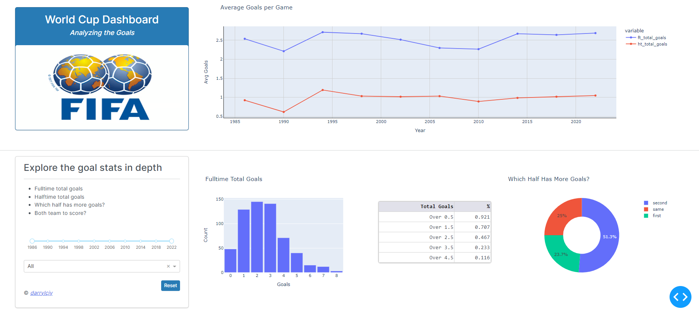

# World Cup Goals Analysis Dashboard

This application is a portfolio project built using Plotly's Dash , faculty.ai's Dash Bootstrap Components, and Pandas. Using historical FIFA World Cup data, this Dash app provides visualizations for goals statistics dating from 1986 to 2022.

## The Analysis

This dashboard aims to explore the following:
 - Fulltime Total Goals
 - Halftime Total Goals
 - Which half has more goals?
 - Do both teams score?

Users can filter these goal stats by year and by stage _(eg. Group stage, Semi-finals, etc)_.

<kbd>  <kbd>

## Built With

- [Dash](https://dash.plotly.com/) - Main server and interactive components
- [Plotly](https://plotly.com/python/) - Used to create the interactive plots 
- [Pandas](https://pandas.pydata.org/) - Data manipulation and analysis

## Data

The data used in this application was retrieved from [Kaggle](https://www.kaggle.com/) and [FIFA](https://www.fifa.com/tournaments/mens/worldcup). 
See `data/sources.txt` for full list.
